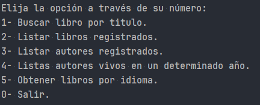

# Literalura

_Este el proyecto para la segunda ruta: Java y Spring Framework de One-Alura. El Objetivo es consumir una API de
Gutendex y listar los diferentes libros y autores._

## Comenzando 🚀


Mira **Deployment** para conocer como desplegar el proyecto.


### Pre-requisitos 📋

_Que cosas necesitas para instalar el software y como instalarlas_

```
Unicamente debe clonar el proyecto y ejecutar la clase Main
```

### Instalación 🔧

Configure el archivo `application.properties`:
   ```properties
   spring.application.name=Literalura
    spring.datasource.url=jdbc:postgresql://localhost/literalura_db
    spring.datasource.username=su-usuario
    spring.datasource.password=su-clave
    spring.datasource.driver-class-name=org.postgresql.Driver
    spring.jpa.database-platform=org.hibernate.dialect.PostgreSQLDialect
    spring.jpa.hibernate.ddl-auto=update
   ```

_Y ejecute_

```bash
   mvn spring-boot:run
   ```

_Obtendrá el menú_ 


_Funcionalidad:_

```
  - 1: Buscará el libro en la API y lo registrara en la base de datos.
  - 2: Retornará el listado de los libros registrados en la base de datos.
  - 3: Retornará el listado de los autores resgirados en la base de datos.
  - 4: Retornará los autores vivos segun el año indicado.
  - 5: Retornará los libros según el idioma.
  - 0: Finaliza el programa.  
   ```


## Construido con 🛠️

* [JAVA](http://www.dropwizard.io/1.0.2/docs/) - Lenguaje
* Java 21
* Spring Boot 3.4.1
* Hibernate
* PostgreSQL
* [Gutendex API](https://gutendex.com/) - API

## Contribuyendo 🖇️

Por favor lee el [CONTRIBUTING.md]() para detalles de nuestro código de conducta, y el proceso para enviarnos pull requests.

## Wiki 📖

Puedes encontrar mucho más de cómo utilizar este proyecto en nuestra [Wiki](https://github.com/tu/proyecto/wiki)

## Versionado 📌

Usamos [SemVer](http://semver.org/) para el versionado. Para todas las versiones disponibles, mira los [tags en este repositorio](https://github.com/tu/proyecto/tags).

## Autores ✒️

* **David Moreno** - *Trabajo Inicial* - [David Moreno](https://github.com/DavidMoreno1785)

## Licencia 📄

Este proyecto está bajo la Licencia (Tu Licencia) - mira el archivo [LICENSE.md](LICENSE.md) para detalles

---
⌨️ con ❤️ por [David Moreno](https://github.com/DavidMoreno1785) 😊